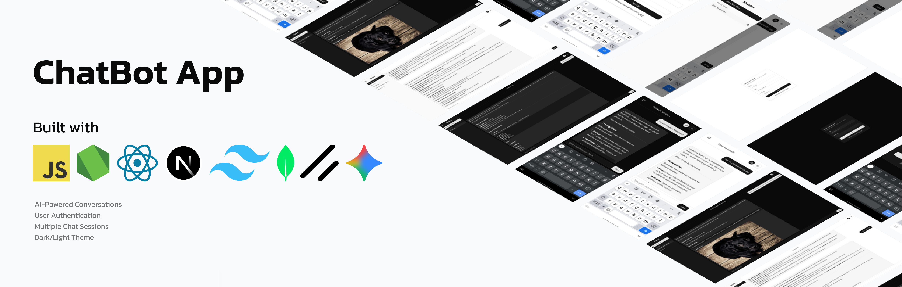

# AI Chatbot



Modern AI chatbot with Next.js 15, React 19, and Google Gemini AI.

## Live Demo

[Live Demo](https://aichatbot-khaki-three.vercel.app/)

## Features

- 🤖 AI conversations with Google Gemini
- 👤 User authentication 
- 💬 Multiple chat sessions
- 🌓 Dark/light theme
- 📱 Responsive design
- 💾 MongoDB storage

## Tech Stack

- Next.js 15, React 19, Tailwind CSS
- MongoDB, Google Gemini AI
- Radix UI components

## Quick Start

1. **Clone and install**
   ```bash
   git clone https://github.com/SheharBano-Sheri/aichatbot/.git
   cd aichatbot
   npm install
   ```

2. **Environment setup**
   ```bash
   copy .env.example .env.local
   ```
   
   Add to `.env.local`:
   ```env
   GEMINI_API_KEY=your_google_gemini_api_key_here
   MONGODB_URI=your_mongodb_uri_here
   MONGODB_DB=your_database_name_here
   ```

3. **Run**
   ```bash
   npm run dev
   ```

## Deployment

Deploy to Vercel: Push to GitHub, connect to Vercel, add environment variables.

## License

MIT License